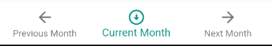

# calunedar: [see it in action](https://kaiyote.github.io/calunedar/)

It's a calendar. But with a Lunar bent. It tells you the day. Basically it.

## Features

### Navigation

The App Bar shows the currently displayed Month & Year.
You can click on the gear to open the settings drawer.

The Bottom Navigation is how you maneuver through the months in the app.
Hit Previous Month or Next Month to go to the previous or next month.
Tapping Current Month will return you to "Today".

### The Settings Drawer

Here you can swap between implemented calendar types, as well as toggle settings
unique to that calendar. In the picture, the Coligny Calendar has been selected
and you can see a setting to set whether you want the metonic cycle version or
not.

### The Calendar

Its a calendar. "Today" is highlighted. Days w/ lunar events have those events
displayed on the day in question for quick viewing. Days from previous/future
months are greyed out.

### The Event Readout

Tells you what event is happening at what time on what day. It almost certainly
displays the time in your local timezone. If your screen is short enough to not
render both the calendar and the readout at the same time (likely will always
happen on landscape orientation desktop monitors), this little icon will
appear in the bottom left corner:

Clicking on it will scroll the Readout into view.
